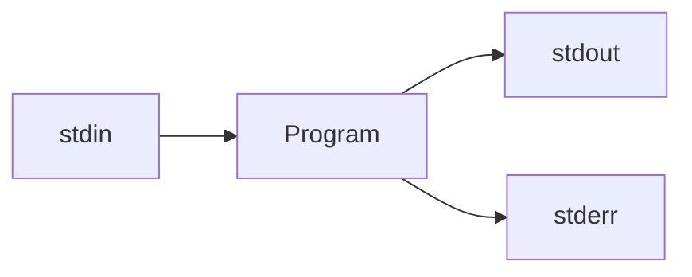

# 1. Linux


## 1.1 The Teaching Environment

### SSH

SSH is a cryptographic network protocol that provides secure (encrypted) connections between a client (i.e. your computer) and a server (i.e., the School's Ubuntu server).

When connected to the school server using SSH, the commands are executed in the server, not on local computer. Only the output of the command is transmitted back to your computer and shown in a terminal window.


### git: a Version/Revision Control System

- `git` is a popular version/revision control system that was developed by Linus Torvalds.
- it has become somewhat of an industry standard
- you get a local repository that are free to modify, allowing you to rollback changes, branch code, etc. This functionality is not available on SVN(Subversion)/CVS.


### Copying files

Use the `scp` command.

The core `scp` format is

```bash
scp source destination

each of the source/destination can be of the form:
[[user@]host1:]file1
```


- you can use SSHFS to mount your student account as a drive (can view the file in a Finder Window)


### Zipping Files

- you should ensure you have zipped the correct files by copying them to a clean directory and `unzip` it.

- Syntax:

  ```bash
  zip [options] zipfile files_list
  
  Syntax for creating a zip file:
  zip myfile.zip filename.txt
  ```


### Miscellaneous

- press on on the up arrow `↑` to see previous commands you have entered
- press the Ctrl-r key to search backwards through the bash history
- the command `clear` will clear the terminal
- When typing a command or a file name, press `tab` to autocomplete the word if the remainder of the word is not ambiguous (unique)


### Modules for this course

- Linux Shell
- C++
- Tools
- Software Engineering


## 1.2 Interacting with the Shell

### Linux Shell

**Shell**: a program that runs in computer and provides a user interface to the **OS**, get the OS to "do" things

OS: **operating system**, the software running on your machine that makes it interactable for human (OS is what really "do" things for you on your computer, e.g. run programs, manage files)

Two kinds of shells:

- Graphical shell - **(GUI)** graphical user interface (typically interacted through click/touch)
- Command line Shell - **(CLI)** command-line interface (type commands in; gives more ease in certain versatility)

In this course we are going to use a specific shell, "**bash**" (Bourne Again Shell), this is a command-line shell.

The shell manages user input and output and interprets and executes commands.


Check what shell you're running:

```bash
$ echo $0

Output:
-bash
```


### Standard Input and Output

There are three standard input and output devices used by the shell:

1. **Standard Input** `stdin`: the shell is reading text input (typically from a keyboard)
2. **Standard Output** `stdout`: the shell is writing text output (typically writes to a monitor)
3. **Standard Error** `stderr`: the shell is writing text output similar to *stdin*, but outputs error messages. By default, both output devices write to the same place (the terminal or monitor), but we can *redirect* them to different places (`2>`). Advantage of doing this is that error messages do not clutter the output files and corrupt formatting. Also, stdout may be *buffered*, meaning that the system may wait to accumulate output before actually displaying (*flushing*) it. stderr is *never buffered*, so error messages are displayed immediately.

EVERY program executed on your OS is attached to *three streams*.



```bash
$ myProgram arg1 arg2 < inputfile.txt > outputfile.txt 2> logerror.txt
```


### How to use the Shell


#### The File System

The files on computers are organized into **directories** (also known as **folders**).

A **path** is the general name of a file or directory in a textual format.

The character `/` is used as the delimiter between directory and file names.


#### 		Absolute and Relative Paths

**Root** is the starting point of the file system, and is denoted only by `/`. **root** is at the top of your directory hierarchy.

All paths are somehow relative to the root directory.

- any path that begins with `/` is an **absolute path** because it clearly identifies where the file or directory is in the file system (contains the root directory)

  ```bash
  / -> the root of the file system
  /file.txt -> a file named file.txt in the root directory
  /etc/ -> a directory
  /usr/share/dict/words/file.txt -? a file in the directory /usr/share/dict/words
  ```

- any path without a preceding `/` is a **relative path**, it is always *relative* to the current directory (or working directory). The shell always keeps track of what is the current directory.

- a dot `.` identifies the *current* directory, two dots `..` identifies the *parent* of the current directory

  ````
  file.txt -> a file named file.txt in the current directory
  subdir/abc/file.txt -> subdir must be in the current directory
  ./script.sh -> a file named script.sh in the current directory
  ../bin/script.sh -> a file named script.sh in the bin directory, which must be in the parent of the current directory
  ````

  

commands in bash are typically names of a program you want to execute

Types of commands:

- **Scripts** are text files that contain commands in a specific programming language. They are not executed directory by the operating system, but read by a program that interprets and executes the commands (the interpreter) (e.g., bash - works as a script interpreter, python, php, etc.)
- **Programs** are files that contain commands in *binary format*. The file contents are sequences of bytes that are meant to be understood by the operating system, not by a human. Therefore, OS directly executes a program, without needing an interpreter. Usually, a program is written in a specific programming language and then *compiled* (e.g., C++ programs)


- #### Cat

Reads the contends of stdin and writes it to stdout. The input of `cat` can be **redirected** to read from and write to files.

Displays the content of a file

  ```bash
  $ cat /usr/share/dict/words
  ```


- #### pwd

Stands for "print working directory" - prints out the path to the current working directory (display the current directory)

```bash
$ pwd
Output:
/u9/y287yuan
```


- #### cd

changes the current directory

```bash
$ cd
cd .. -> go to parent directory
cd . -> to current directory (no change)
cd -> return to root directory
```


The **home directory** is a directory owned by the user, containing personal files without disturbing other users' files.

```bash
~/cs246 -> ~ replaces the absolute path of home directory
this is still an absolute path, the same as saying
/u9/y287yuan/cs246
```


Summary of Directories:

| Directory                                           | Meaning                     |
| --------------------------------------------------- | --------------------------- |
| .                                                   | Current directory           |
| ..                                                  | Parent of current directory |
| ~                                                   | Home directory              |
| /                                                   | Root directory              |
| Starts with / or ~                                  | Absolute path               |
| Does not start with / or ~ (may start with . or ..) | Relative path               |


#### 	The $PATH Variable

A global system variable named **$PATH** that specifies where the shel should file executable files.

The contents of the $PATH are a list of pathnames separated by the colon character `:`.

```bash
$ echo $PATH
>>> /home/gustavo/bin:/usr/local/bin:/usr/bin
```

Any command that contains a file name will look for executable files in those directories only.

Use a relative path or absolute path to look for files not in the $PATH directories:

```bash
$ myprogram -> looks for file named myprogram in one of the directories in the $PATH system variable
$ ./myprogram ->looks for myprogram in the current directory
```

You can add a frequently used directory to teh $PATH variable (without removing the current contents of the variable):

```bash
export PATH=${PATH}:/program/path
```


#### File Permissions

- #### ls

Lists (non-hidden) files  and directories in the current directory

```bash
ls (non-hidden files)
ls -a (lists all files, including hidden files)
ls -l
ls -f
```

`ls -a` lists *all* files (including hidden) in the current directory. Hidden file is any file whose name begins with a period `.`(e.g., .bashrc, .bash_history, .aliases)

`ls -l` gives a *long form* listing, which displays the file permissions and other information

```bash
-rw-r----- 1 y287yuan cs246 42 Jan 21 04:29 abc.txt
type/perms   owner    group size  modified  name
```

- **type**: `-` for an ordinary file; `d` for a directory
- **permissions**: three groups of three bits
- **owner**: the ID of the user that owns the file, usually the user who created the file, ownership can be transferred to another user (using command `chown`)
- **group**: A user can belong to one or more groups. A file can be associated with one group. When a user and the file are in the same group, the group permissions are in effect for that user.
- **size**: the size of the file in bytes
- **modified**: the date and time when the file was last modified
- **name**: the file name


Each file or directory has a set of three types of permissions: user, group, and other:

- **user permissions**: apply to the file's own user
- **group permissions**: apply to members of the file's group (other than the owner)
- **other permissions**: apply to everyone else


Each of these three types may contain three specific permissions: Read, Write, and eXecute:

| Bit   | Meaning for ordinary files                               | Meaning for directories                                      |
| ----- | -------------------------------------------------------- | ------------------------------------------------------------ |
| **r** | file's contents can be *read*                            | directory's contents can be *read* (e.g., ls, globbing, tab completion) |
| **w** | file's contents can be *modified*                        | directory's contents can be *modified* (can add/remove files) |
| **x** | file's contents can be *executed* as a program or script | directory can be *navigated into* (i.e., can `cd` into the directory) |

Note: If a directory's execute bit is not set, there is no access at all to the directory, no matter how the other bits are set.

The permissions are displayed by `ls` are the nine characters that follows the type bit, in the format `rwxrwxrwx`, first 3 are user permissions, middle 3 are group permissions, and last 3 are other permissions.

If a permission is not set, then a `-` is displayed instead.


To change a file permission, use the command `chmod <mode> <file>`

`<mode>` consists of three parts:

1. user types: u(user/owner), g(group), o(other), or a(all)
2. operator: +(add permission), -(subtract permission), or =(set permission exactly)
3. permissions: r(read), w(write), and/or x(execute)


#### Other Commands

- #### dos2unix

`dos2unix` will turn a non-valid Linux text file into an valid Unix Linux text file.


- #### Ctrl+C `^C`

Ctrl+C will forcibly stop the executing program , this *kills* the program if any programing is going on for too long.


- #### Ctrl+D `^D`

Ctrl+D will end a program from running, such as when we just typed `cat` and want to end the input.

This is a special character known as **EOF** (end-of-file), it signals that the input has ended.


- #### man

Opens up the manual page to the command following `man`. 

`man <command name>`


What happens if we **just type cat**, no files after it? 

\- Nothing will appears to happen, but `cat` is waiting to read input. So we can type and send input to cat, it will print out everything we type just like it printed out the contents of the file. It is printing out the contents of the input, instead of printing out the contents of a file.

```bash
$ cat
In:Hello 
Out:Hello
In:There
Out:There
```

 

It could be useful if we can capture the output of `cat` into a file. Which we can.

```bash
$ cat > output.txt
any output from the cat command will be piped into output.txt
^D
```

To stop providing input, use `^D`, NOT `^C`, `^C` kills a program that's taking too long to execute, doesn't allow that program to exit gracefully, this program(`cat`) isn't taking too long, it's simply waiting for input.

Hence, we use `^D` to signal "**End-of-File(EOF)**" to the program.


---

### Redirecting input/output

In general:

```bash
$ command args > file
```

Executes "command args", and captures the output in file, instead of sending it to the screen. This is called **output redirection**. Note that the OPERATING SYSTEM is the one moving the output to the file, the program is still just asking to print to the screen.


We can also redirect input:

```bash
$ cat < inputfile.txt
it will print the contents of inputfile.txt to screen
```

This prints the same as `$ cat inputfile.txt` but something very **different** is happening.

In the command `$ cat inputfile.txt`, the OS is running the program `cat`, and passing to that program the argument, which is the string "inputfile.txt", the program `cat` then chooses to open the file "inputfile.txt" because it received that name as a *command-line argument*, and then `cat` reads from the file. The code here that is written and executed in `cat` is code for reading from a file.

When we run the command `$ cat < inputfile.txt`, this is actually the program cat running with **no arguments**. This is just like when we typed the command `$ cat` , and then typed into the keyboard. The program `cat` sees no arguments and asks to *read from input* into the keyboard. However, since we are **redirected** input to the file inputfile.txt, instead of asking the user to type in the keyboard, the **operating system** instead reads the contents of "inpuefile.txt" to `cat` as the input. The OS did the redirection before cat is executed.


```bash
$ cat < inputfile.txt aTextfile.txt
it will print the contents of aTextfile.txt to screen
```

This is because if cat has a command-line argument, it **won't** read from stdin.

```bash
$ cat < inputfile.txt aTextfile.txt -
it will print both the contents of aTextfile.txt and inputfile.txt to screen (aTextfile.txt first then inputfile.txt)

-- we can switch the order of '-'
$ cat < inputfile.txt - aTextfile.txt
it will print both the contents of inputfile.txt and aTextfile.txt to screen (inputfile.txt first then aTextfile.txt)
```

The hyphen `-` as a cmd-line argument tells cat: please print also the content read from standard input.


---

#### Command-line Arguments & Difference Between Arguments and Input Redirection

Pass arguments to a program or script by writing each argument separated by a space after the command name

```bash
$ cat -n file.txt (-n tells cat to prefix each line with a number)
```

Cat receives the filename as an *argument*, it will look for the file, open the file and read its contents instead of reading from stdin.

```bash
$ cat -n < file.txt
```

The OS will open the file and redirect its content into cat's stdin. Cat will not receive the file name and will *only* read from stdin.


- #### wc

`wc` stands for word count, it tells <# of lines> <# of words> <# of characters> <filename>

Usage:

```bash
$ wc -c print the byte counts
$ wc -m print the character counts
$ wc -l print the newline counts
$ wc -w print the word counts
$ wc -L print the maximum display length of a line
```


If we `wc` two of more files, it will output the total word count of all files.

Examples:

```bash
$ wc output.txt 
Output:
5 22 106 output.txt

$ wc output.txt someFile.txt
Output:
5 22 106 output.txt
0 0 0 someFile.txt
5 22 106 total

$ wc
dskljlkdj
sdsjdlkjs sdksjdl sd
sdssds
      3       5      38
```

Difference when using redirection:

```bash
$ wc output.txt -wordcount knows it is reading a file [this is a command-line argument]
 5 22 106 output.txt
$ wc < output.txt -wordcount believes it is reading from input [this is not]
 5 22 106
*The operating system is giving the input from the file to wc
```


YOU CAN'T `$ echo < output.txt` because `$ echo` **does not read from stdin**, it only takes arguments.

 ```bash
 $ echo a file.txt	-> echo just prints its argument back to stdout
 a file.txt
 $ echo a < file.txt -> stdin was redirected to file.txt, but echo does not read from stdin, so input was not used
 a
 ```


Many (but not all) commands accepts both forms of input.

You can do both input and output redirection at the same time!

```bash
$ cat < inputfile.txt > outputfile.txt
cat takes input from inputfile.txt and put the output into file outputfile.txt
(cat reads from stdin, which the OS feeds to it from inputfile.txt. cat prints out the input to the screen, and the OS redirects it to outputfile.txt)

this behaviours similar to cp
$ cp inputfile.txt outputfile.txt [this is taking command line arguments]
This will copy the cotents from inputfile.txt to outputfile.txt
```


```bash
$ cat -n < inputfile.txt > outputfile.txt
```

NOTE! `-n` here is a command line argument, while inputfile.txt is the file to redirect input from, and outputfile.txt is the file to redirect output to. NEITHER of those are command line arguments. (`<>` are also not arguments because they are asking the OS to redirect I/O)

This command has effectively copied inputfile.txt to outputfile.txt with line numbers attached.


NOTE! Be careful when using the same file for redirecting I/O. `cat < thisfile.txt > thisfile.txt` this will overwrite thisfile.txt to an empty file. This is because when thisfile.txt is being redirected for output, the system will treat it as an empty file (output redirection will overwrite the file). So cat will read an empty file and then redirect it to an empty file. This is a bad idea.

`$ cat thisfile.txt > thisfile.txt` will also empty the file, because when the program runs, the OS will empty the file to redirect the output (overwrites it). This is NOT a left to right things, if the output is redirected, the operating system will make it empty to begin with.


#### Quoting Arguments

The shell treat white spaces as separators between arguments. Use quotes `" ", ''`to pass a single argument that contains spaces. 

The single quotes `' '` will not interpolate anything (e.g., variables), whereas double quotes `" "` will:

```bash
$ echo a  b 	c	-> three separate arguments
a b c
$ echo "a  b 	c"  -> a single argument
a  b 	c
```

```bash
$ echo "My shell is $0" -> double quotes replaces $0 by its value
My shell is -bash
$ echo 'My shell is $0' -> no variable substitution
My shell is $0
```


***

### Pipes

Pipes `|` allow us to use the output of one program as the input to another by connecting the second program's stdin to the first program's stdout.


Example 1: How many words occur in the first 20 lines of myfile.txt?

```bash
$ head -20 myfile.txt | wc -w
```

There is no limit on how you can combine piping and I/O redirection.

```bash
$ cat file.txt | head -20 | wc -w > words.txt
```


Example 2: Suppose words1.txt and words2.txt contain lists of words one per line, print a duplicate free list of all words that occur in any of these files

```bash
$ cat words*.txt | sort | uniq
uniq will omit repeated line (lines need to be adjacent to each other (i.e., sorted))
```


We can also use the output of one program as the ARGUMENT to another program.

A **subshell** creates another bash shell to execute a command within a command. We create subshell with the syntax `$(command)`.

Here, the shell executes the commands date and whoami, and substitutes the results into the command line

```bash
$ echo "Today is $(date) and I am $(whoami)"
Today is Thu 20 Jan 2022 10:41:39 PM EST and I am y287yuan
$ echo 'Today is $(date) and I am $(whoami)'
Today is $(date) and I am $(whoami)

- substitution only occurs inside double quotes, never inside single quotes
```

Notice the difference between using double quotes and single quotes.

It is important that we used double quotes if we want this to be one string. Using single quotes will give you the literal string, single quotes do not allow *any substitution* to occur within them. BUT, important to note, both quotes suppress globbing pattern substitution.

```bash
$ echo "*"
*
$ echo '*'
*
$ echo *
-> prints out all files/directories in the current directory
```


```bash
$ echo Today is $(date) and I am $(whoami)
Today is Thu 20 Jan 2022 10:41:39 PM EST and I am y287yuan
```

Here echo is receiving 12 arguments while in the first command (output of $(date) becomes 6 command line arguments to echo), echo is receiving one argument. The behavior is the same. You may want to give a string as a single argument to a program.

Note that the substitution with the subshells happen BEFORE echo ever runs. Bash runs date and whoami, substitutes them in the output, and *then* runs echo with the substituted contents.


We can combine the use of echo and cat to output the contents of a file. 

However, cat *preserves the original file format* while echo changes the whitespace of the text

```bash
$ cat helloworld.txt
hello
	world

$ echo | cat helloworld.txt
hello
	world
	
$ echo $(cat helloworld.txt)
hello world
```

Use the subshell `$( )` to tell the shell to execute the cat command before passing the result as command-line arguments to echo


---

### Globbing Pattern

The shell can automatically expand a *few wildcard patterns* to match all the files that satisfy the pattern. This is known as **globbing** pattern.


```bash
$ cat *.txt
```

The syntax `*.txt` is what is called a *globbing* pattern. In the context of globbing patterns, the wildcard character `*` means "match *any* sequence of characters", when the shell encounters a globbing pattern, it will find all (non-hidden) files in the current-directory that fit the pattern and substitutes them onto the command line.

The above command line might be replaced with:

```bash
$ cat abc.txt bcd.txt cde.txt
```

This is where cat gets it name (con**cat**enate)


The following operators are used in globbing patterns:

| Operator | Meaning |
| -------- | ------- |
| *        | matches **0 or more** characters |
| ?        | matches **1** character |
| [abc]        | matches **exactly one** of the characters in the brackets |
| [!abc]        | matches any character **except** the ones in the brackets |
| [a-z]        | matches any character in the given range |
| {pat1, pat2}        | matches either pat1 or pat2 (note no spaces) |


## 1.3 Regular Expressions


### Pattern-Matching in Text Files

`egrep` stands for Extended global regular expression print, it looks for lines that match a pattern.

`egrep <pattern> <file>`: This will print every line in file that matches pattern.

The patterns that `egrep` understands are called *regular expressions*, and are NOT the same as globbing patterns, and more powerful.


Example 1: print every line in alice.txt that contains Rabbit

```bash
$ egrep "Rabbit" alice.txt
```


egrep is *case-sensitive*

Example 2: print every line in alice.txt that contains "Rabbit" or "rabbit"

```bash
$ egrep "Rabbit|rabbit" alice.txt -> here "|" means "or", the pipe does not have its meaning from bash, this is a string.

$ egrep "(R|r)abbit" alice.txt
$ egrep "[rR]abbit" alice.txt
```


egrep has an optional `-i` argument, which makes its pattern matching *case-**in**sensitive*

```bash
$ egrep -i "Rabbit" alice.txt -> match all "Rabbit" or "rabbit"

$ egrep -i "CS246"
this will match: cs246 Cs246 CS246 cS246
```


- `(c|C)(s|S)246` matches any string that says CS246 with ANY capitalization: Cs246, CS246, cS246, cs246
- square brackets can be used to provide a list of characters and say "Match any one of these characters": `[cC][sS]246` - does same thing as above
- `[cC][sS] ?246`: the question mark means "**0 or 1** of the immediately preceding character (or sub-pattern)", so this matches any capitalization of cs246 that also may have a space between the "cs" and the "246", examples: cs 246, Cs246, cs246, CS 246, ...
- ? makes a pattern *optional*
- The caret `^` with square brackets say "match any character that is NOT one of these characters", use this to look for anything BUT a set of characters. `[^abc]` - match any character that is NOT an a, b, or c.
- The syntax `*` indicates **0 or more** occurrences of the preceding character or sub-pattern. so `(cs)*246` matches 246, cs246, cscs246, cscscs246, ...
- The syntax `+` indicates **1 or more** occurrences of the preceding character or sub-pattern. so `(cs)+246` matches cs246, cscs246, cscscs246, ...
- we could simulate `(cs)+246` by writing `(cs)(cs)*246`
- `[cs]*246` this matches NAY sequence of c's and s's followed by 246: 246, s246, c246, sc246, cs246, sccccc246, cscscscs246, ...
- The character `.` indicates "any single character". `cs.*246` this matches any line that has "cs" then any single character, then 246
- `.*` means match any string
- `.+` means match any NON-EMPTY string
- the special patterns `^` and `$` (when `^` isn't in square brackets), represent the beginning and end of a line, respectively.
- `^cs246` matches only lines that BEGIN with cs246
- `^cs246$` matches only lines that contain exactly cs246
- if we want to match a *special* character, then we need to *escape* that character with an escape character `\`

```bash
$ egrep "^Alice.*\.$" alice.txt -> matches any line that begins with the string "Alice", followed by any string, and ends with the period character (being escaped here).
```

- Square brackets will actually automatically escape many of our special characters, because it means "match any of these characters within the square brackets". However, hyphens gain new meaning to create ranges:
- `[a-z]` - match any lowercase character
- `[0-9]` - match any digits
- `[a-zA-Z0-9]` - match any alphanumeric character. Note there are some other ASCII characters between the upper/lowercase rangers, so be careful to use separate ranges `[a-zA-Z]`
- you could use `[.`] to escape the period like `\.`
- If you want to use a hyphen in the square brackets, it goes last


Example: Fetch all lines of even length from alice.txt

```bash
$ egrep "^(..)*$" alice.txt
(..)* will only match any line that contains a string of even length, so we need to specify that this is a LINE.
```

Match all odd length lines:

```bash
$ egrep "^.(..)*$" alice.txt
OR
$ egrep "^(..)*.$" alice.txt
```


Example: list all files in the current directory that contains exactly one "a"

```bash
$ ls | egrep "^[^a]*a[^a]*$"
match 0 or more non-a characters, then a, then 0 or more non-a characters
```


Examples: fetch all words in the global dictionary that start with e and consists of exactly of five characters

```bash
$ egrep "^e....$" /usr/share/dict/words
if we dont want apostrophie
$ egrep "^e[^'][^'][^'][^']$"
```


## 1.4 Bash Scripts


**Shell Script**: File that contains a sequence of shell (bash) commands, executed as programs.


Example: Print the date, current user, and current directory

```bash
#!/bin/bash --> shebang line
date
whoami
pwd
```

To execute this bash program, it must have execute bits set, so first change its permission `chmod u+x printStuff`

Then specify to execute `./` : `./printStuff`, this is giving a relative path, we need to provide a path (either absolute or relative) to the program to tell bash: don't search for this program in the list of programs, just run it. Otherwise, bash looks for it in the directories listed in your "PATH" variable.

The line `#!/bin/bash` is called the **shebang** line, indicating that the file should be executed as a bash script. This line tells the executing shell which shell language the script is written in.

Specifically, `#!` says "this should be executed as a script", and `/bin/bash` says "here is the interpreter to use to interpret this script"

Note: you can change your shebang line to `#!/bin/bash -x`, the `-x` option tells bash to print every command and its arguments as it executes.


### Variables

Bash has variables

Naming conventions: (similar to C)

- start with a letter or underscore
- consists of letters, digits, and underscores

```bash
$ x=1
```

NOTE: very important: **no spaces**.

```bash
$ echo $x
>1
```

Notes: 

- use `$` when fetching the value of a variables, 
- no `$` when setting the variable, (`$` = fetch the value of)
- Good practice: use curly braces when reading a bash variable `$ echo ${x}`
- All variables in bash are *strings*, e.g. `x` above contains the string "1"

```bash
dir=~/cs246 --> set dir as a variable
echo ${dir}
> /u9/y287yuan/cs246
```


#### Some important global variables

**PATH**: list of directories, these directories are where the shell will search for commands when you ask it to execute a program. It searches in order that list of directories for a program with that name.

Note: if there are two files with the same name in two separate directories in PATH, then it will find the execute the one in the first path found.

```bash
$ echo "${PATH}"
> will expand the PATH directories (prints the value of the PATH variable)
$ echo '${PATH}'
> ${PATH} (prints literally the string "${PATH}")
```


We can use the `env` command to see a number of global variables.


#### Special Variables for Scripts

**`$0`** - the *first* command line argument, it is the command being executed, i.e. the shell-script name

**`$1, $2, etc.`** - command line arguments! based on their position

**`$#` **- the total number of command line arguments

**`$?`** - the exit/return value of the most-recently executed command, used to tell us whether it succeeded or failed, *0 means success*, while non-0 means failure


If you run `echo $0` when not in a shell script, it is asking "what is the current running program", which is our shell -bash


Example: Check whether a word is in the dictionary

e.g. ./isItAWord hello

Have it print nothing if the word is not found, print the word if it is found

```bash
#!/bin/bash
egrep "^${1}$" /usr/share/dict/words --> since each line contains one word

change mode:
chmod u+x isItAWord

run it:
./isItAWord <word-to-find>
```


#### Selection Statements

Example: A good password should not be a word in the dictionary, answer whether a password is *definitely bad* (i.e., in the dictionary), or *might be okay* (i.e. not in the dictionary)

```bash
#!/bin/bash
egrep "^${1}$" /usr/share/dic/words > /dev/null
# Note: redirecting to /dev/null supresses output, it goes nowhere
# Note: every program produces a status code when it is done executing
# Exit status for egrep: 0 if a line is selected, 1 if no lines were selected, 2 if error occured
# $? = retrieve the status code of the most recently executed program

if [ ${?} -eq 0 ]; then # by using -eq we can force bash variables to be treated as numbers (by default they are strings)
	echo "Bad password"
else
	echo "Maybe not a terrible password"
fi # end your if in bash
```

**Note**: `/dev/null` is the Linux equivalent of throwing the standard output into the garbage


If the user executes our program with the wrong number of arguments, we should let them know:

``` bash
#!/bin/bash

usage() {
	echo "Usage: $0 password" # $0 is the name of program being executed	
}
# $# = retrieve the number of arguments
if [ ${#} -ne 1]; then
	usage # usage tells the user how to use this script
	exit 1 # terminate our script with a failure (non-zero) value
fi

egrep "^${1}$" /usr/share/dict/words > /dev/null

if [ $? -eq 0]; then 
	echo "Bad password"
else
	echo "Maybe not a terrible password"
fi
```

**Note**: by default, the program returns 0 to indicate success if it runs to completion.

`>&2` redirects standard input to standard error


General form of an `if` in bash

```bash
if <condition1>; then # use semicolon to separate "then"
	<statements>
elif <condition2>; then
	<statements>
elif <condition3>; then
	...
else
	<statements>
fi
```

Be careful with spacing **!** There must be a blank space between the opening square bracket and the condition being tested, and a blank space between the condition and the closing square bracket.

```bash
if [ ${foo} = "cat" ]; then
	...
fi

if [ $foo -eq 2 ]; then
	...
fi
```

- Use `-a` for "and" and `-o` for "or", see `man [`


#### Loops in Bash

There are two types of loops in bash: a *counted* loop, and a loop that *iterates over a list* of items

**Counted loop**

A counted loop requires a variable to which we add or subtract a value, or modify in some way. The loop terminates when we reach a specific value or some condition evaluates to true.

```bash
while [ cond ]; do
	...
done
```

Example -- printNumbers

```bash
x=1
while [ ${x} -le ${1}]; do
	echo ${x}
	# we need to increment x, but x is a string
	# we need to force arthimetic
	x=$((x+1)) # $((...)) is the syntax for arithmetic operations
done
```

**Note**: the special syntax `$(( ... ))` is used to tell the shell that the information within the doubled-parentheses are to be **treated as integers**. (by default bash treats values as strings)


Some options if you want to print the numbers on the same line:

```bash
printNumbers

#!/bin/bash
x=1
out=""	# introduce an empty string "out"
while [ ${x} -le ${1}]; do
	out="$out $x" # concatenate the string
	x=$((x+1))
done
echo ${out}
```

another way to use `echo -n` which does not output the trailing new lines

```bash
printNumbers
#!/bin/bash
x=1
out=""	# introduce an empty string "out"
while [ ${x} -le ${1}]; do
	echo -n $x " " # we can add a space between each number
	x=$((x+1))
done
echo "" # we can add a new line at the end
```


**List iteration Loop**

Looping over a list of (string) values, either written directly into the loop, or generated as the result of executing a command.

```bash
for variable in list; do
	command1
	command2
	...
done
```


listLoop:

```bash
#!/bin/bash
for x in a b c; do echo $x; done # looping over the iterable things (a b c) we put here

>> a
>> b
>> c
```


Example: How many times does the word $1 occur in the file given in \$2

```bash
countWords

#!/bin/bash

x=0
for word in $(cat $2); do
	if [ $word = $1 ]; then # equal = is for string equality
	x=$((x+1))
	fi
done
echo $x
```


#### Functions

Functions can only return a positive integer value in the range 0 to 255.

We specify the contents of the function's body by putting statements inside curly braces `{}`


Example: Payday is the last Friday of each month. Compute this month's payday. (2 tasks: compute the date; present the answer)

```bash
payday

#!/bin/bash

# present the answer
report() { # Inside a function $1, etc denote the "functions" parameters
	if [ $1 -eq 31 ]; then
		echo "This month: the 31st"
	else
		echo "This month: the ${1}th"
	fi
}

# figure out the date
report $(cal | awk '{print $6}' | egrep "[0-9]" | tail -1)

```


Example: Generalize this script to any month (not just the current)

```bash
payday

#!/bin/bash

report() {
	if [ $1 -eq 31 ]; then
		echo "$2 $3: the 31st"
	elif [ $1 -eq 23 ]; then
		echo "$2 $3: the 23rd"
	elif [ $1 -eq 22 ]; then
		echo "$2 $3: the 22nd"
	else
		echo "$2 $3: the ${1}th"
	fi
}

# figure out the date
report $(cal $1 $2 | awk '{print $6}' | egrep "[0-9]" | tail -1) $1 $2

```


Example:

```bash
#!/bin/bash

foo() {
	echo "name is: " ${0}
	echo "foo argument 1 is: " ${1}
	echo "foo argument 2 is: " ${2}
	echo "foo argument 3 is: " ${3}
	if [ ${1} = "cat" ]; then
		return 0
	fi
	return 1
}

# calls foo
foo ${3} ${2} ${1}
echo 'foo returned ${?}' ${?} # print the status code
```


