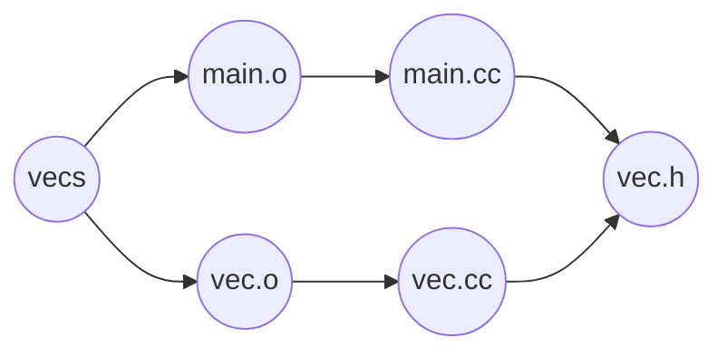

# C++


Hello World in C:

```c
#include <stdio.h>
int main() {
    prinf("Hello world\n");
    return 0;
}
```


Hello World in C++:

```cpp
#include <iostream>
using namespace std;

int main() {
    cout << "Hello world" << endl;
    return 0;
}
```

`endl` prints out a newline and flush the buffer.

Notes:

- main *must* return int in c++
- stdio.h and printf are still available in C++, but we are not going to use them
- preferred C++ I/O header: <iostream>
- output: `sts::cout << ... << ... << ... ;`
- `std::endl` = end of line
- `using namespace std;;` allows us to omit the `std::` prefix
- return statement; in main returns the status code to the shell ($?); can be omitted from main (0 is assumed)


## Compiling

Compile C++ programs: 

````
g++ -std=c++14 program.cc -o program
````

If the `-o program` (name of the program) is not specified, the compiler will produce a program named a.out


*Most* C programs are valid C++ programs.

Other compiling flags:
| flag	| use|
| ------------ | ------------------------------------------------------------ |
| `-g`         | Produce debugging information in the operating system's native format. The GNU debugger, `gdb`, can work with this debugging information. Makes your code larger, but useful while trying to get everything working. |
| `-c`         | Produce an object file (ends in .o) that consists of assembler output. Will be useful once we discuss *separate compilation*. |
| `-Wall`      | This enables all the warnings about constructions that some users consider questionable, and that are easy to avoid (or modify to prevent the warning). Not necessary, but a good idea. |
| `-Wextra`    | This enables some extra warnings that aren't enabled by `-Wall`. Not necessary, but a good idea. |
| `-Wpedantic` | This ensures that your code follows the strict ISO C++ standard, with no forbidden extensions. Not necessary, but a good idea. |
| `-D`         | Lets us define a macro name as a command-line argument to the compiler. Useful for selectively adding/removing code during the compilation process. |


## Input/Output

There are 3 I/O streams:

- stdout/stderr connected to std::cout/std::cerr
- stdin connected to std::cin


### I/O operators

- `<<` = "put to" (output), e.g. `cerr << x` "put x to cerr"
- `>>` = "get from" (input), e.g. `cin >> x` "cin read into x"
- very easy to remember which operator is which because the arrows are pointing in the "flow" of the information


Example: addTwoNumbers

```cpp
#include <iostream>
using namespace std;

int main() {
    int x,y;
    cin >> x >> y; // cin >> x; cin >> y;
    cout << x + y << endl;
}
```

Notes: 

- `cin >>` ignores whitespace (space/tab/newline)
- `cin >> x >> y` gets two integers from stdin, skipping whitespace


What if the input doesn't contain an integer next? Or the integer is too larger/too small? What is the input is exhausted before we get two integers? Statement fails; value of variable is one 0, max-int, or min-int.


If the read fails: `cin.fail()` will be true (We can check the fail bit of cin)

If we have reached EOF: `cin.eof() cin.fail()` will be true, BUT not until the attempted read fails. Only if you *try* to read something, and found that it is EOF


Example: Read all integers from stdin, and echo them out, one per line, to stdout. Stop on any bad input or EOF

```cpp
#include <iostream>
using namespace std;

int main() {
    int i;
    while (true) {
        cin >> i;
        if (cin.fail()) break;
        cout << i << endl; // print out one per line
    }
}
```


Version 2.0

```cpp
#include <iostream>
using namespace std;
// There is an implicit conversion from cin to bool. cin is regarded as true if its fail (or bad) bit are not set. This permits cin to be used as a condition.

int main() {
    int i;
    while (true) {
        cin >> i;
        if (!cin) break;
        cout << i << endl; // print out one per line
    }
}
```


Version 3.0

Recall: cin >> x >> y; // equivalent to cin >> x; cin >> y;

We get (cin >> x) >> y;

The input operator >>, has cin (of type istream) as its first operand and some data (in this case an int, but it could be of several possible types) as its second operand. 

What is the output (Return value) of this operator?

:arrow_right: It returns back the stream itself (in this case: cin,  cin is the return value)

If a read returns back cin, and cin can be used as a bool, we can simplify this further:

Version3.0

```cpp
#include <iostream>
using namespace std;

int main() {
    int i;
    while (cin >> i) {  // if we read into i and it is successful
        cout << i << endl; // print out one per line
    }
}
```


Example: Read ALL ints and echo to stdout until EOF. Skip non-integer input.

```cpp
#include <iostream>
using namespace std;

int main() {
    int i;
    while (true) {
        if (!(cin >> i)) { // either non-int input, or readed EOF
            if (cin.eof()) break; // if we've reached EOF we're done
            // if we haven't reached EOF we have a failed read, and the
            // fail bit is set. If the fail bit is set, no reads from
            // the stream can occur, 
            // so we need to turn the fail bit off.
            cin.clear(); // clears the fail bit
            // If a read fails, nothing is removed from the input stream, so the
            // offending character that stopped us from reading an integer 
            // is still there. So we need to remove it.
            cin.ignore(); // Ignores the current input character
            
        }
        cout << i << endl;
    }
}
```


Note: 

cout << 95 << endl; // prints 95

What if we wanted to print the number in hexadecimal?

cout << hex << 95 << endl; // print 5f (in hexadecimals)

`std::hex` is an I/O manipulator. It causes all subsequent integers to be printed in hexadecimal.

To switch back, use `cout << std::dec`. For all other manipulators see **<iomanip>** manpage online.

Potentially useful:  `std::noskipws` (Note, only works when reading chars)


## Strings

In C: a string is an array of characters (char * or char[]), terminated by \0 (the null character)

- Must explicitly manage your memory, allocate more memory as strings get larger
- Easy to accidently overwrite \0 and corrupt memory


C++ strings: `#include <string>, type std::string`

- grows as needed (no need to manage memory)
- safer to manipulate (a lot harder to mess up invariants)


```cpp
#include <string>
std::string s = "Hello";
std::string name{ "Jane" };
```

Even in C++, the literal "Hello" represents a C-style string (a C constant character pointer), i.e. a null-terminated array of characters.

The variable s is a C++ string whose contents are initialized based on the C-string "Hello"


Some string operations:

- equality and inequality: s1 == s2, s1 != s2
- comparison: s1 <= s2, (lexicographic order)
- length: s1.length(), s1.size()
- fetch individual chars: s[0], s[1], s[2], etc. (indexing starts at 0 and goes up to s.length()-1)
- concatenation: s3 = s1 + s2; s3 += s4; 
- check out [manpages](http://www.cplusplus.com/reference/string/string/) for string


```cpp
#include <iostream>
using namespace std;

int main() {
    string s;
    while (cin >> s) {
       // Reads a string (skipping leading whitespace) and stops reading at next ws
    	// (i.e. read one word)
    cout << s; 
    }
}
```


If we want to read an entire line (including whitespace), we can use getline

`getline(cin, s)`reads until the next newline character into s.

```cpp
#include <iostream>
#include <iomanip>
#include <string>
using namespace std;

int main() {
    int i = 1;
    string s;
    while (getline(cin,s)) { // getline doesn't skip initial whitespaces
        cout << setw(3) << i++ << ":\"" << s << '\"' << endl;
    }
}
```

`getline()` returns false when failure or end-of-file.


We can also read characters

```cpp
#include <iostream>
using namespace std;

int main() {
    char c;
    while (cin >> noskipws >> c) {
        cout << c;
    }
}
```

Change our program to remove subsequent whitespaces:

```cpp
#include <iostream>
using namespace std;

int main() {
    char c;
    char lastChar = 'a';
    while (cin >> noskipws >> c) {
        if (lastChar == ' ' && c == ' ') continue; // don't print it out
        cout << c;
        lastChar = c;
    }
}
```


Lets write our own readNumbers:

```cpp
#include <iostream>
using namespace std;

int readInt() {
    char c;
    int sum = 0;
    while (true) {
        if (cin.peek() < '0' || cin.peek() > '9') breaks;
        cin >> c;
        // turn it into a number
        int x = c - '0';
        sum *= 10; // shift one decimal left (mult by base 10)
        sum += x;
    }
}

int main() {
    cout << readInt() << endl;   
}
```


This abstract idea of a stream applies to other sources of data, not just I/O

### File I/O

Example: files, read from a file instead of stdin. Use std::ifstream to read from a file and std::ofstream to write to a file

Reading from a file is almost identical to reading from stdin, instead of including the `iostream` library, you need to include the `fstream` library and use the `ifstream` type. Writing to a file uses `ofstream` type.

**File access in C**

```c
#include <stdio.h>

int main() {
    char s[256];
    FILE *file = fopen("suite.txt", "r");
    while (true) {
        fscanf(file, "%255s", s); // read the next word up to 255 characters long; huge headache if word is larger than 255
        if (feof(file)) break;
        printf("%s\n", s);
    }
    fclose(file);
}
```


**In C++**

```cpp
#include <iostream>
#include <fstream>
using namespace std;

int main() {
    ifstream file{"suite.txt"};
    // Declaring and initializing an ifstream opens the file
    string s;
    while (file >> s) {
        cout << s << endl;
    }
} // file is coused automatically when the ifstream variable goes out of scope
```


Anything we can do with cin/cout, we can do with an ifstream/ofstream

```cpp
fileIO.cc

#include<fstream>

int main() {
    std::ifstream infile{ "input.txt" };
    std::ofstream outfile{ "output.txt" };
    int i;
    while ( true ) {
        infile >> i;
        if ( infile.fail() ) break;
        outfile << i << std::endl;
    }
}
```

The curly braces `{}` are used to initialize the file stream objects.


### Command-line Arguments

The `main` function may take two arguments, `argc` and `argv`, with `argc` representing the number of arguments the program received, and `argv` representing the array of arguments ( is an array of char pointers `char **`)

```cpp
args.cc

#include <iostream>
    
int main(int argc, char **argv) {
    for (int argi = 0; argi < argc; argi++) {
        std::cout << argv[argi] << std::endl;
    }
}
```

This in shell:

```bash
$ g++ args.cc -o args
$ ./args This is a test
./args
This
is
a
test
$ ./args "This is a test"
./args
This is a test
```

Note: `argv[0]` is the name of the program itself, and normal arguments continue from there.


### String Streams

There is a type in C++ called `stringstream`, available in the `#include <sstrem>` library. It is a hybrid of both the `std::string` class, and the I/O stream classes. It lets you read/write to/from strings using stream operators. Use the type explicitly defined for input: `istringstream`, and the type for output: `ostringstream`


Example: Strings. Use stream to read from /write to strings.

`#include <sstream>`, `std::istringstream` to read from a string, and `std::ostringstream` to write to a string.

```cpp
sting intToString(int n) {
    ostringstream oss;
    oss << n;	// write a number to a stream
    return oss.str();
}
```


E.g. convert a string into a number

```cpp
int n;
while (true) {
    cout << "Enter a number" << endl;
    string s;
    cin >> s;
    istringstream iss{s};
    if (iss >> n) break;	// stop we got a number
    cout << s << "is not a number" << endl;
}
cout << "you entered" << n << endl;
```

isstream for "reading from", and osstream for "writing to"


**Revisit**: Echo all integers, skip non-integers

```cpp
#include <iostream>
#include <sstream>
using namespace std;
// Read all integers, skip non-integers
int main() {
    string s;
    while (cin >> s) {
        istringstream iss{s};
        int n;
        if (iss >> n) cout << n << endl;
    }
}
```


**Input string streams**

The primary purpose for using an input string stream is to take an existing string, such as the sentence "The quick brown fox\njumped over the lazy\tdog.", and split it up into separate words. By default, the `istringstream` separates the words (often called tokens) by whitespace. (Remember, *whitespace* consists of blanks, tabs, and newlines).

The input stream function `std::getline` lets us specify the *delimiter* to use when reading in lines of input as strings, we can specify a delimiter to separate our tokens.

Example: istringstream.cc

```cpp
#include <iostream>
#include <sstream>
#include <string>
using namespace std;

int main() {
    string s;
    string s1{ "The quick brown fox\njumped over the lazy\t dog." };
    istringstream ss1{s1};
    while (ss1 >> s) {
        cout << s << endl;
    }
    string s2{"Smith, Jane, 99999, Yu, Hello, 88888"};
    istringstream ss2{s2};
    cout << "***" << endl;
    while (getline(ss2, s, ',')) {
        cout << s << endl;
    }
}
```


**Output String streams**

Use an output string stream object, `ostringstream`, to build up a string from a variety of other types.

Example: buildString.cc

```cpp
#include <iostream>
#include <string>
#include <sstream>
using namespace std;

int main () {
  ostringstream ss;
  int lo {1}, hi {100};
  ss << "Enter a # between " << lo << " and " << hi;
  string s {ss.str()};
  cout << s << endl;
}
```


## Functions

Basic format:

```cpp
return-type function-name( type1 arg1, type2 arg2, ... ) {
    return value of appropriate type;
}
```

Using `-wall` when compiling your program will warn you of this error.

### Forward declarations

Separate a function into **declaration**(signature) and its **definition**(implementation).

Example: forwardGood.cc

```cpp

#include <iostream>
#include <iomanip>
using namespace std;

bool odd(unsigned int n);		// foward declare it here so we can use in the next function

bool even(unsigned int n) {
  if (n == 0) return true;
  return odd(n - 1);
}

bool odd(unsigned int n) {
  if (n == 0) return false;
  return even(n - 1);
}

int main() {
  cout << boolalpha << even(3) << " " << even(4) << " "
      << odd(3) << " " << odd(4) << endl;
}
```


### Default Function Parameters 

An argument may or may not be supplied to that parameter. 

```cpp
void printSuiteFile(string name = "suite.txt") {
    // "suite.txt" is a default value for parameter name
    ifstream file{name};
    string s;
    while (file >> s) cout << s << endl;
}

printSuiteFile(); // prints from suite.txt
printSuiteFile("suite2.txt"); // prints from suite2.txt
```

**Note**: optional parameters must be the *last* parameters. Or else it is ambiguous.

int addStuff(int x=5, int y, int z=10) {...}

addStuff(7,2); // x=7, y=2, z=10?

addStuff(7,2); //x=5, y=7, z=2

The default values are, by convention, usually listed in the function declaration and not in the function definition. They cannot occur in both locations!


## Overloading

in C:

```c
int negInt(int a) { return -a; } // function to negate an int 
bool negBool(bool b) { returen !b; } // functino to negate a bool
```


in C++: Functions with difference parameter lists can share the *same* name

```cpp
int neg(int a) { return -a; }
bool neg(bool b) { return !b; }
```

It's fine to do this!

This is called **overloading**.

The compiler uses the number and types of arguments to decide which neg is being called (i.e. decision is made at compile time). Overloads must differ in *number or type of parameters*, just differing in return type is not enough (the compiler won't distinguish based on return types.

We've seen overloading already: `<<, >>` are overloaded; their behaviour depends on the types of their arguments.


## Structures

A structure for a Node:

```cpp
struct Node {
    int data;
    Node *next; // pointer to the next node
};	// semicolon at the end of declaring a structure

Node *head = nullptr;
Node n{5, nullptr}, n1 = {6, head};
```

 **Note**: in C we would have to say `struct Node *next; `, in C++ we don't need the 

`struct`. Don't forget the semiclon! C++ no longer uses NULL, should be using `nullptr` instead.

If a node stores a node, it will have an infinite size. The compiler needs to know how much space to allocate before compiling. Hence, we *must* have a pointer pointing to the next node.

A pointer just contains a memory address, and the size of memory addresses is known at compilation.


## Constants

```cpp
const int maxGrade = 100; // Must be initialized when it is defined
```

Declare as many things const as you can, it helps catch errors.

```cpp
Node n1 {5, nullptr};
// nullptr is the syntax in C++ for null pointers, do NOT use NULL or 0 in this class!
const Node n2 = n1;
// defining a new node n2 which is an immutable(const) copy of n1

```


## Parameter passing

Recall:

```c
void inc(int n) { ++n; }
...
int x = 5;
inc(x);
cout << x << endl; // prints 5, why?
```

**Call-by-value**: inc gets a *copy* of x and increments the copy. (The copy will be modified and the original will be unchanged)

Solution: if a function needs to mutate an argument, pass a pointer.

```cpp
void inc(int *n) { ++*n; } // notice the user of pointer and derefercing here
...
int x = 5;
inc(&x); // x's address is passed by value; inc changes the data at the address of x
cout << x << endl; // prints 6 (changes the value of parameter)
```


Question: why can we say `cin >> x` and not `cin >> &x` ?

Answer: C++ has another pointer-like type: **references**


## References (very important!)

The general rule is to pass information by reference, because you don't need to remember to dereference your pointers all the time.

```cpp
int y = 10;
int &z = y; // a reference to z
// the & in a type means a reference; the & in an operator means the address of the operator
// the type of z is (int &)
// z is an lvalue reference to an int, behaves LIKE a const ptr, BUT a reference is NOT a pointer
```

Note： the ampersand `&` in a type means a reference, the `&` as an operator means the address of the operator (e.g. &operator=, the copy  assignment operator)

A reference is NOT a pointer, they are distinct types!

A references is an lvalue that acts *like* constant pointers with automatic dereferencing.

```cpp
int y = 10;
int &z = y; // z is an lvalue reference
z = 12; // Note: NOT *z = 12; now, y is equal 12
cout << y << endl; // prints 12
```

In ALL cases, a reference will behave exactly like the data it refers to.

```cpp
int *p = &z; // Taking the address of z, gives the address of y (the thing it refers to)
// z refers to y, so the address of z: &z, refers to the address of y
```

In other words, z is an **alias** for y. (z is another name for y). This means, z is another name for y, and z behaves like y in all circumstances.

A **reference** is an **alias** for an already existing variable, it cannot be changed to refer to another variable, hence it behaves similar to a constant pointer.


Since it is a constant, it must be initialized when it is defined.

There are **rvalues** and **lvalues**. If you can take the address of an expression, it is an **lvalue**; otherwise, it's an **rvalue**.

Thank of an lvalue as something that can appear on the left-hand side of an assignment statement. For example:

```cpp
int x = 5;
int * ptr = nullptr;
// x and ptr are both lvalues
```


What is a **reference**? A **reference** is an lvalue that acts like a constant pointer but the compiler automatically dereferencs it. Since it is constant, it **must** be initialized when defined.

```cpp
int x = 5;
int &y = x;		// type of y is (int &)
int *ptr = &y; // &y is the address of x, so ptr points to address of x 
y += 2;
*ptr += 3;	// ptr contains the address of x
cout << x << endl;
```


Things you **can't do** with lvalue references:

- leave them uninitialized (e.g. int &x)
  - Must be initialized with something that has an address (lvalue)
  - `int &x = 3;` // Not allowed, 3 does not have an address, it is an rvalue
  - `int &x = y + z; ` // Not allowed, the return value of y+z is not stored somewhere in our program and does not have an address
  - `int &x = y;` // Ok (as long as y is defined)

- Cannot create a pointer to a reference, (e.g. int &*x). BUT can have a reference to a pointer (e.g int *&x = ...;)
- Cannot create a reference to a reference (e.g. int &&r). Actually this has another meaning
- Cannot create an array of references
  - e.g., int &r[3] = {n, n, n};

By the rules of C++. references are not guaranteed to have any memory themselves. (They don't always take memory)


Create a reference to an integer pointer:

```cpp
int *& refPtr = ptr; // read form right-to-left
```


What can you do with references? Passing as function parameters, or the return type of a function:

```cpp
void in(int &n) {
    ++n; // No dereference here, n is a reference to the argument provided
}

int x = 5;
inc(x);
cout << x << engl; // prints 6
```

Why does `cin >> x` work? Because it takes x by reference:

```cpp
std::istream &operator >> (std::istream &in. int &n);
// the prototype of an input operator
```


### Pass-by-value

**Pass-by-value**: int f(int n) {...} copies the argument

If the parameter is of a large type, this copy could be expensive

```cpp
struct ReallyBig {...};	// struct that holds a *lot* of information

int f(ReallyBig rb) {...} // Copies rb, potentially slow. See move.copy ellision

int g(ReallyBig &rb) {...} // Alias, fast, BUT caller might accidentally change the value supplied

int h(const ReallyBig &rb) {...} // take a constant reference, fast, not copt, parameter cannot be changed - no unintented side-effects.
```

**Advice**: prefer pass-by-const-ref over pass-by-value for anything larger than integer, UNLESS the function needs to make a copy anyways, then possibly use pass-by-value.


Also:

```cpp
int f(int &n) {...} // cant bind non-const lvalue reference to an rvalue (5)
int g(const int &n) {...}

f(5); // NOT allowed, cannot bind the lvalue reference n to the literal value 5. If n changes, it can't change the literal value 5
g(5); // OK because we promised the compiler we wouldn't change it, so we get away with it.
```

How is it that g(5) works? The compiler creates a *temporary* location in memory to store the number 5, and that way n has something to refer to.


## Dynamic Memory Allocation

C:

```cpp
int *p = malloc(... *sizeof(int));
...
free(p);
```

DO NOT use these in C++, Instead, use `new` and `delete`, they are type aware, less error prone, and more convenient


```cpp
struct Node {
    int data;
    Node *next;
}

Node *np = new Node;
// np is a varianle on the stack, it's a pointer variable and it stores the memory address of a Node that we just created that is stored on the heap
delete np;
```

- All local variables reside on the stack

- variables are deallocated when they go out of scope (stack is popped)

- allocated memory (with new) resides on the *heap*

- allocated memory remains allocated until it is explicitly freed with delete

- If you don't delete all allocated memory: **memory leak**

  Programs will eventually fail. Any memory leak results in incorrected program

  
```cpp
#include <iostream>

struct Node {
    int data;
    Node *next;
};

int main() {
   Node n{ 5, nullptr };
   Node * np = new Node{ 3, &n };
   std::cout << n.data << ' ' << np->data << std::endl;
   delete np;
}
```


### Array Forms

```cpp
Node *myNodes = new Node[10];
// An array of 10 nodes on the heap
// myNodes is a stack-allocated pointer to the first node in that array
...
delete []myNodes; // Note the square brackets
```


It is important to match the correct form of delete with the corresponding new. 

If memory was allocated with the ordinary `new` then it must be deallocated with the ordinary `delete`.

If the memory was allocated with the array form `new`. then it must be deallocated with the array form `delete[]`. 

Mixing the two forms of new and delete results in undefined behaviour. (the compiler can do anything at once)


### Returning by value/pointer/reference

There are three ways in which we can return information from a function in C++:

1. return by *value*

2. return by *pointer*

3. return by *reference*

   

```cpp
Node getMeANode() {
    Node n;
    return n;
    // possibly expensive: n is copied to the caller's stack frame on return
}

// What about returning a pointer (or reference) instead?
Node *getMeANode() {
    Node n;
    return &n;	// returning a pointer to node n
}

// As soon as the function returns, n no longer exists,
// so returning it's address is returning an address to data
// that's dead on return (dangling pointer)

Node *getMeANode() {
    Node *np = new Node{0, nullptr};
    return np;
}

// This is okay - returns a pointer to heap data that will persist after this function returns, but the caller is now responsible for deleting it

...
Node n = getMeANode();  
...
delete n;
```

Which should you pick? Most times return by value - it is not as expensive as it looks.

What about return by reference?

```cpp
Node &getMeANode() {
    Node n{0, nullptr};
    return n;
}

// EXACT same problem as returning a pointer here, (dangling ptr)
// we have a reference to memory that gets destroyed as
// soon as this runction returns, the receipient is receiving a reference to 
// local variable that no longer exists once the function ends


Node &getMeANode() {
    Node *n = new Node{0, nullptr};
    return *n;	// return dereferenced n
}

// Sure - BUT this is a bit tricky for the caller, the caller have to delete it

// if the caller says
Node n = getMeANode();
// This is a Instant memory leak! n is a local copy of the node reference that was allocated on the heap - no longer have the address to it.

Node &n = getMeANode();
// Now n is a reference to that heap allocated now
...
delete &n; // will give us the address of the heap-allocated memory to free
```

In general, avoid doing this. If you're going to return a reference it should usually be because it's something you already have a reference to (like a parameter that was passed in).


### Optional Files

The convention in Linux to use square brackets in the documentation is to show that these command-line arguments are optional.

```bash
./a.out [ input-file-name [ output-file-name ] ]
```

- if two command line arguments are present, the first is the name of the input file to use, the second is the output file
- if only one command line argument is present, it is the name of the input file to use, the output goes to stdout
- if no arguments are present, the program reads from stdin and writes to stdout


In C++, we modify the `main` program to show it now has two arguments, first is the number of arguments (int), second is the array of NULL terminated C-style string (char*).

```cpp
./ a.out "abc def" 123
 
int main(int argc, char *argv[]) {
    ...
}

// here argc = 3, and argv will be an array of 4 C strings, where the fianl element is the C equivalent to the C++ nullptr.
// each element of argv is a pointer to a null-terminated array of characters, i.e. a C string
```


We learned how to overload functions, and we can also overload operators.

## Operator Overloading

We can give meanings to C++ operators for types we create

```cpp
struct Vec {
   int x, y;
};

Vec operator+(const Vec &v1, const Vec &v2) {
    Vec v{v1.x + v2.x, v1.y + v2.y};
    return v;
}

// Scalar multiplication

Vec operator*(const int k, const Vec &v) {
    return {k*v1.x, k*v1.y};
    // Okay because the compiler knows its a Vec based on the
    // return type and constructs it from these values
}

...
    
Vec v{3, 4};
Vec w = 5 * v; // Calls the function above
Vec z = v + w;
Vec q = v * 10; // Doesn't work!Doesn't match the parameters above!

// Just make another function
Vec operator*(const Vec &v, const int k) {
    return k*v; // just call the other previously defined operator*
}

```


### Overloading >> and <<

```cpp
struct Grade {
    int theGrade;
};

ostream &operator<<(ostream &out, const Grade &g) {
    return out << g.theGrade << '%';	// return the output stream
}

istream &operator>>(istream &in, Grade &g) {
    in >> g.theGrade;
    if (g.theGrade < 0) g.theGrade = 0;
    if (g.theGrade > 100) g.theGrade = 100;
    return in;	// return the input stream back
}
```

Rules for writing an output operator:

1. The return type is always (std::ostream &)
2. The function name is always operator <<
3. The first parameter is always the output stream (std::ostream&)
4. The second parameter is always the information being output. If it's the size of an integer or smaller, you can pass it by value, but it's usually a constant reference
5. Before you do anything else, write the return statement to return whatever the name of the output stream is.

```cpp
std::ostream &operator<<(std::ostream &out, const typeToPrint &value) {
    out << v; // whatever is appropriate for the type you are outputting
    return out;
}
```

The input operator changes both the input stream since it is consuming information from it. The second parameter that is supposed to hold the information read in from the input stream. This should imply to you that both parameters need to be passed as references, and not as constant reference.

```cpp
std::istream &operator>>(std::istream &in, Grade &g) {
    in >> g.theGrade;
    if (g.theGrade < 0) g.theGrade = 0;
    else if (g.theGrade > 100) g.theGrade = 100;
    return in;
}
```

Rules for writing an input operator:

1. The return type is always (std::istream &)
2. The function name is always operator>>
3. The first parameter is always the input stream (std::istream &)
4. The second parameter is always the information being read in. It will be a reference
5. Before you do anything else, write the return statement to return whatever the name of the input stream is.

```cpp
std::istream &operator>>(std::istream &in, typeToRead &value) {
    in >> v; // whatever is appropriate for the type you are reading in
    return in;
}
```


## The Preprocessor

Both C and C++ used a tool called the **C preprocessor**, which is tasked with handling **preprocessor directives** like `#include`.

The preprocessor's primary purpose is to control what code is included in the program.

Transforms the program *before* the compiler sees it.

```cpp
#_______ - Preprocessor directive
e.g. #include
```

Including old C header: new naming convention. 

Instead of e.g.` #include <stdio.h>`, use `#include <cstdio>`.


To run only the preprocessor, use the `-E` flag to `g++`, the preprocessor will output to standard out.

```bash
$ g++ -std=c++14 -E name.cc
```


### Constant definition

```cpp
#define VAR VALUE
```

sets a preprocessor variable with the name VAR. The preprocessor will replace all occurrences of VAR in the source file with VALUE (Except for those in quoted strings).

Example:

```cpp
#define MAX 10;
int x[MAX];

// would be transformed to:
int x[10];

// However, if you want to define for an array length, you should just have that to be a constant variable, but not a preprocessor
```

This is mostly unneeded, it is more type-safe to use `const ` definitions. 


### Conditional compilation

We can combine constant definitions with conditional compilation, another preprocessor feature.


If you are writing a program that need to be build on both Linux or Windows.

```cpp
#define OS Unix
...
#if OS == Unix // this is a preprocessor if, happens before the compiler sees it
#include <SDL2/sdl.h>
#elif OS == Windows
#include <sdl.h>
#endif
```

`#if` supports `#elif` and `#else`.

```cpp
#define SECURITYLEVEL 1
#if SECURITYLEVEL == 1
short int
#elif SECURITYLEVEL == 2
long long int
#endif
publicKey;
```

It is common to use `#define` to add debugging to the code and easily remove it.


Now: you can also just define a flag

```cpp
#define FLAG
```

defines the preprocessor variable with that name, its value will be the empty string


### Preprocessor definitions in the command line

We can define preprocessor symbols by compiler arguments.

The argument is `-DVAR=VALUE`, where *VAR* is the name to define and *VALUE* is the value to set.

```cpp
preproc.cc
#include <iostream>
using namespace std;

int main() {
    cout << X << endl;
}

// compile it
g++14 -DX="\"Hello world\"" preproc.cc

>>> Hello world
```


We can use this to print debug statements. `#ifdef` checks if a preprocessor variable is set at all, rather than checking its exact value.

```cpp
#ifdef NAME/ #ifndef NAME: true if the preprocessor variable with NAME has/has not been defined
```


```cpp
int main() {
    #ifdef DEBUG
    	cout << "Setting x = 1" << x << endl;
    #endif
    int x = 1;
    while (x < 10) {
        ++x;
        #ifdef DEBUG
        	cout << "x is now: " << x << endl;
        #endif
    }
}


// compile:
g++ -DDEBUG debug.cc
>> Setting x = 1
>> x is now: 2
>> x is now: 3
>> x is now: 4
      ...
>> x is now: 10
```

The opposite of `#ifdef` is `#ifndef`. However, these is no `#else` for `#ifdef`.


### Preprocessor commenting

Special case: `#if 0 ... #endif`. `#if` 0 is never true, so all of the text inside the if will be removed before the compiler sees it.

Think of functions as a heavy-duty "comment out" of large segments of code, since `#if 0` nests properly.


## Separate Compilation

Split programs up into composable modules, which each provide:

- **interface** (header): type definitions, and prototypes (declarations) for functions (.h file)
- **implementation**: full definition for every provided function (.cc file)


Recall:

- **declaration**: asserts something exists (function or variable, but doesn't define its content)
- **definition**: full details of how something should work, allocates space (for variables and functions)

You can declare something as many times as you want - you can define things ONLY ONCE

Example:

This is our header file:

```cpp
// vec.h
// This is a full definition of type Vec, we can't define Vec again
struct Vec {
    int x,y;
}

// This is a declaration
Vec operator+(const Vec &v1, const Vec &v2);
// parameter names can be omitted in declarations
```

This is our implementation

```cpp
// main.cc (client code - USES our module)
#include "vec.h"
int main() {
    Vec v{1,2};
    v = v + v;
}

// vec.cc (implementation)
#include "vec.h"
Vec operator+(const Vec &v1, const Vec &2) {
    return {v1.x + v2.x, v1.y + v2.y};
}

// To compile:
g++14 -c main.cc
// We will get
main.cc main.o vec.cc vec.h
g++14 -c vec.cc
// We will get
main.cc main.0 vec.cc vec.h vec.o
// Now to link these objects
g++14 vec.o main.o -o main
// Now we have the executable
main
```

 

**Compiling separately**:

`g++ -c vec.cc` compile only -- do not link

`g++ -c main.cc` produces an object (.o) file

`g++ vec.p main.o -o main` links our objects into the executable

What happens if we change vec.cc? Only needs to recompile vec.cc and then relink.

```bash
g++ -c vec.cc
g++ vec.o main.o -o main
```

The `-c` option requests g++ that a `.cc` file be compiled into a `.o` file, or an **object file**. An object file contains compiled code, but not enough for a full program. In this case, main.o contains `main` (from main.cc), and vec.o contains the `+`operator for Vecs (from vec.cc).

You can use .o files like .cc files when outputting a program, combining multiple .o files to create a program is called **linking**.

Since .h files contain no code, only declarations, they shouldn't be compiled at all!


What happens if we change vec.h? Well then since main.cc and vec.cc both include vec.h, they both must be *recompiled*, and then *relinked*.

How can we keep track of dependencies of modules and perform minimal compilation?


## Make and Makefile

The relationship between the files created a system of **dependencies**.




Linux tool: **make**

Create a Makefile that says which files depend on which other files, and how to build them.

```bash
Makefile	# must places in a file names "Makefile"

main: main.o vec.o
		# this must be a tab character, or else make won't work
		g++ main.o vec.o -o main

main.o: main.cc vec.h
		g++ -std=c++14 -c main.cc
		
vec.o: vec.cc vec.h
		g++ -std=c++14 -c vec.cc

# fake optional target
.PHONY: clean

clean:
		rm *.o main		# remove everything the compile done
```

The lines not indented here are *dependencies*, they show that the file before the colon depends on the file(s) after the colon. 

Each file is a **target**, which is something this Makefile describes how to create.

The command to create any given target is called a **recipe** (the lines that starts with g++, which are executed as shell commands).


Makefiles are very particular about their whitespace, you need to be using *tabs* for whitespaces.

In general, the command is:

`make target` --- builds the requested target

To use the Makefile, just run the make command:

`make`

then it builds the first target in the makefile. Recursively build any dependencies if necessary.

Make compares timestamps, if a target is older than any of its dependencies then it must be rebuilt.


### Phony Targets

We need commands to clean up after make. This is done through a **phony target**, i.e. a target that exists only for its recipe, and doesn't actually build for anything. The `clean` phony target is commonly used for cleanup commands.

```bash
.PHONY: clean

clean:
		rm *.o vecs
		
		
$ make clean
rm *.o vecs
$
```


### Make Variables

Generalize out makefile with **make variables**:

```bash
CXX=g++ # name for compiler
CXXFLAGS=-std=c++14 -Wall # the space between assignments are important!
OBJECTS=main.o vec.o # define object files
EXEC=main

${EXEC}: ${OBJECTS}
        ${CXX} ${OBJECTS} -o ${EXEC}
        
main.o: main.cc vec.h
# I can omit the recipe, make assumes that the recipe for a .o file is:
# ${CXX} ${CXXFLAGS} -c _____.c

vec.o: vec.cc vec.h

.PHONY: clean

clean:
        rm ${OBJECTS} ${EXEC}
```

The biggest problem we wanted to solve was keeping all over dependencies straight, with this makefile we still need to include all the dependencies for files we want to build. Wouldn't it be nice if make could somehow figure these out automatically?

### Automatic Dependency Management

We can get some help from g++

`g++ -MMD -c vec.cc` creates a vec.o and a vec.d, where `vec.d` includes: `vec.o: vec.cc vec.h` (what vec.o depends on), (.d files are make dependencies).
Include this in our makefile:

```bash
CXX=g++
CXXFLAGS=-std=c++14 -Wall -MMD
OBJECTS=main.o vec.o
DEPENDS=${OBJECTS:.o=.d} # replace .o with .d
EXEC=main

${EXEC}: ${OBJECTS}
        ${CXX} ${OBJECTS} -o ${EXEC}
        
-include ${DEPENDS}  # the '-' means: the these files don't exist, don't worry about it
.PHONY: clean

clean:
        rm ${OBJECTS} ${DEPENDS} ${EXEC}
```

Now, as our project expands, all we have to do is add the .o files ot the OBJECTS variable in the Makefile.


### Global Variables

What if we want a module to provide a global variable?

```cpp
// abc.h
int globalNum;
// WRONG, this is a declaration AND a definition of the variable globalNum, so all files that include this will define a variable named globalNum
```

This is because *defining* a variable allocates space for it, so here we have defined the space twice.

We need some way to say "JUST declare this variable, it will be defined somewhere else that the linker can find".
**Solution**: place the variable in a cc file, and simply *declare* it here with the **extern modifier**

```cpp
// abc.h
extern int globalNum; // declaration but NOT a definition

// abc.cc
int globalNum; // definition, will be linked when linking occurs
```

Note that the `extern` declaration has no initializer. It can't have one, since it doesn't actually allocate the variable, and so can't give it a value. Hence, we still need the actual variable declaration, put it in the .cc file so that it is not allocated multiple times.

This pattern is the same for all global variables which are used in multiple files. Since the header file can only have declarations, we use `extern` there, but the actual variable must still be defined and allocated in an implementation file.


## Preprocessor Guards

Suppose we want to write a linear algebra module:

```cpp
// linalg.h
#include "vec.h"
#include <iostream>

// NEVER NEVER NEVER use "using namespace std" in a header file. It forces that on whoever includes your header, and they may not want it
// they may have names that clash with things in the std namespace

std::ostream& operator<<(std::ostream&, const Vec &);


// linalg.cc
#include "vec.h"
#include "linalg.h"
#include <iostream>
using namespace std;

ostream& operator<<(ostream &out, const Vec& v) {
    cout << "{" << v.x << ", " << v.y << "}";
}


// main.cc
#include "vec.h"
#include "linalg.h"
#include <iostream>
using namespace std;

int main() {
    Vec v{1, 2};
    v = v + v;
    cout << v << endl;
}

```

Consider our linalg module:

```cpp
// linalg.h
#include "vec.h"
...

// linalg.cc
#include "linalg.h"
#include "vec.h"
...

// main.cc 
#include "vec.h"
#include "linalg.h"
...
```

This doesn't compile - why? main.cc and linlag.cc both include vec.h and linalg,h. But linalg.h includes vec.h, so each of main.cc and linalg.cc include vec.h twice. That means they get TWO definitions of the type Vec. You can only define something ONCE.
so how can we fix this?

We need to prevent files from being included more than once.
**Solution**: Use a **preprocessor guard**, also called **#include guard**

```cpp
#ifndef SOME_UNIQUE_MACRO_NAME_H
#define SOME_UNIQUE_MACRO_NAME_H
...
#endif
```


```cpp
// vec.h

#ifndef VEC_H
#define VEC_H
struct Vec {
    int x, y;
}

Vec operator+(const Vec &, const Vec &);
#endif


// linalg.h
#ifndef LINALG_H
#define LINALG_H
#include "vec.h"
#include <iostream>


std::ostream& operator<<(std::ostream&, const Vec &);
#endif
```

```cpp
#include guard:

#ifndef VEC_H
#define VEC_H
... // file contents
#endif
```

The firts time vec.h is included, the symbol VEC_H is not defined, we then immediately define when the file is included.
So, subsequent inlcudes see that this variable has already been defined and are thus suppressed by the preprocessor.

**EVERY** .h file should inlcude a header guard.
**NEVER**: put `using namespace std;` in headers, this forces this directive on clients that use your module, but they may have conflicts.


**NEVER EVER** compile .h files, their contents get compiled as a result of compiling the .cc files that include them

**NEVER EVER** include .cc files! Implementation files are to be compiled only, never included.


